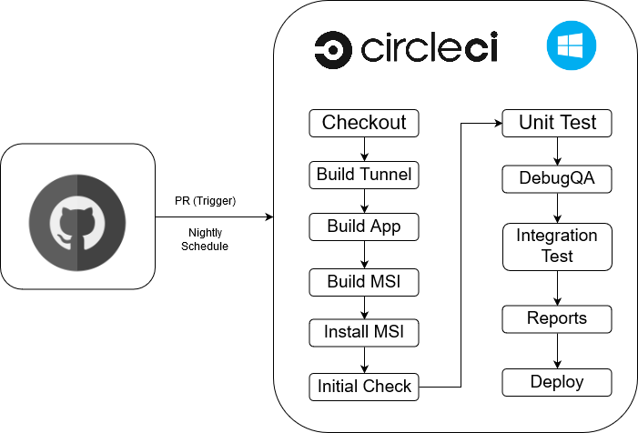

# Testing and deploying

## Automation Testing
### Overview


**CircleCI** is the CI/CD tool that handles all automations. There are three workflows setup in CircleCI. The first workflow will be triggered by any pull request. The second one will be triggered automatically every midnight. The third one will be triggered automatically every 12 hours.

### Workflows
Both PR workflow and Nightly workflow have exactly the same job. The difference between them is the trigger. The workflow which runs every 12 hours has two jobs running sequentially. The first job is the same as PR workflow and nightly workflow. The second job is going to run UI tests on AWS ecosystem.

#### Checkout
- Checkout the latest code

#### Build Tunnel
- Run the script to build the WireGuard tunnel
```
.\tunnel\build.cmd
```

#### Build The Application
- Restore all required packages using `nuget`
```
nuget restore -SolutionDirectory ./
```
- Build the app 
    - Release - 64 bit 
    - Release - 32 bit
    - Debug_QA - 64 bit (this is only for QA testing)
```
MSBuild /t:Rebuild /p:Configuration=Release /p:Platform="x64" 
MSBuild /t:Rebuild /p:Configuration=Release /p:Platform="x86"
MSBuild /t:Rebuild /p:Configuration=Debug_QA /p:Platform="x64"
```

#### Build the MSI
```
.\installer\build.cmd 
```

#### Install the MSI
```
msiexec /log install.log /qn /i installer\x64\FirefoxPrivateNetworkVPN.msi
```

#### Initial Check
- Check the Uninstallation and Installation Process
- Check whether the Application installed or not
- Verify that `tunnel.dll` exists in the application folder
- Check whether tunnel driver installed or not

```
cd test
go test github.com/mozilla-services/guardian-vpn-windows/test/initial -v
```

#### Run Unit Tests
- Use `nunit3-console.exe` to run all unit tests and save the results into XML format
```
cd ui\Guardian.Tests\bin\x64\Debug_QA
nunit3-console.exe /result:.\test\result\unittests\result.xml FirefoxPrivateNetwork.Tests.dll
```

#### Run App In Debug_QA mode
```
Start-Process -FilePath ".\ui\src\bin\x64\Debug_QA\FirefoxPrivateNetworkVPN.exe"
```

#### Run Integration Tests
```
cd test
go test github.com/mozilla-services/guardian-vpn-windows/test/integrations -v | tee test.out
```

#### Generate Test Report
- Use `extent.exe` to transform UnitTest reports from XML to HTML
- Use `OpenCover` to generate code coverage report
- Use `github.com/jstemmer/go-junit-report` to generate integration tests reports in XML
- Use `xunit-viewer` to transform integration test reports from XML to HTML
- All reports are saved into `test/result/`

#### Deploy
- Save the MSI file into `test/result`
```
Copy-Item ".\installer\x64\FirefoxPrivateNetworkVPN.msi" -Destination ".\test\result"
```

#### Upload MSI to S3 (Only for the every-12-hours workflow)
- Upload VPN client MSI to S3 bucket
```
$ProgressPreference = "SilentlyContinue"
Write-S3Object -BucketName $env:S3_BUCKET -File test/result/FirefoxPrivateNetworkVPN.msi -Key msi/$env:CIRCLE_BUILD_NUM/FirefoxPrivateNetworkVPN.msi
```

#### Launch EC2 with Windows 10 (Only for the every-12-hours workflow)
- Launch an EC2 instance with a customized windows 10 image
- After the EC2 instance is launched successfully, the instance will automatically run the script to install the MSI downloaded from S3, start WinAppDriver to prepare for UI testing, run the UI tests.
- After UI tests finish, the EC2 instance will upload the test result to S3 bucket.

#### Pull test result from S3 (Only for the every-12-hours workflow)
- Pull the rest result generated from last step from S3 bucket.
```
$ProgressPreference = "SilentlyContinue"
Read-S3Object -BucketName $env:S3_BUCKET -Key smoke/$env:CIRCLE_BUILD_NUM/smoke_test_result.txt -File test/result/smoketest/smoke_test_result.txt
```

#### Terminate EC2 (Only for the every-12-hours workflow)
- Terminate the EC2 instance after pulling the test result from S3.


## Run UI Tests Locally

#### Download and Install WinAppDriver
- https://github.com/microsoft/WinAppDriver/releases/download/v1.2-RC/WindowsApplicationDriver.msi

#### Download and Install Firefox
- https://www.mozilla.org/firefox/download/thanks/

#### Build UI Test Program
```
cd .\test\smoke\FirefoxPrivateVPNUITest

nuget.exe restore -SolutionDirectory ./ 

& 'MSBuild.exe' /t:Rebuild /p:Configuration=Release
```

#### Start WinAppDriver
```
C:\'Program Files (x86)'\'Windows Application Driver'\WinAppDriver.exe
```

#### Run UI Tests
```
### Run all UI tests ###
vstest.console.exe .\FirefoxPrivateVPNUITest\bin\Release\FirefoxPrivateVPNUITest.dll

### Run specific test ###
vstest.console.exe .\FirefoxPrivateVPNUITest\bin\Release\FirefoxPrivateVPNUITest.dll /Tests:{SPECIFIC_TEST}
```